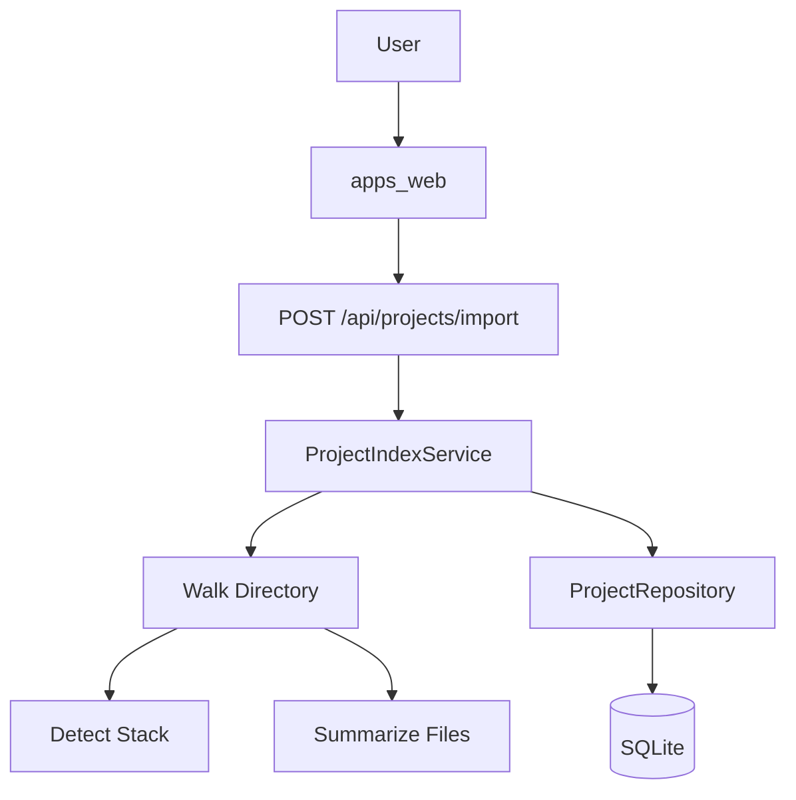
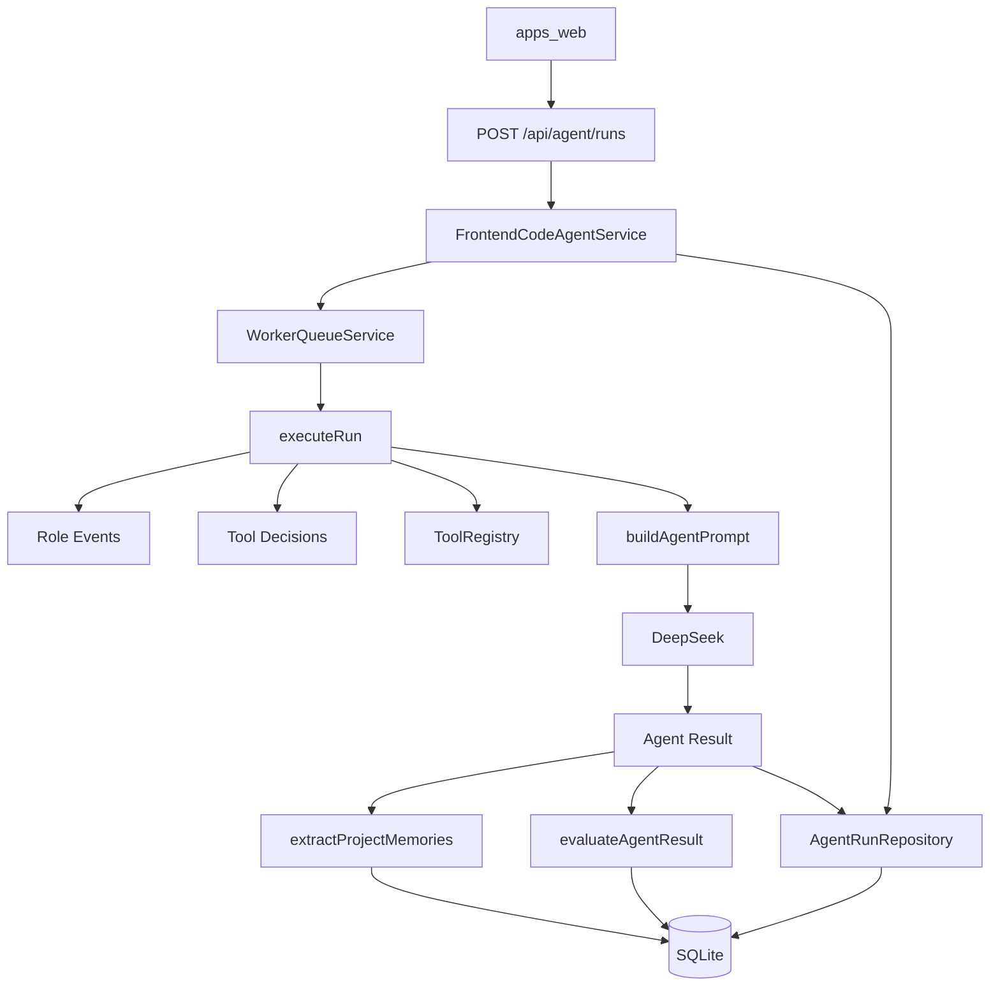

# AgentLab 后端 Agent 架构与功能解析

## 1. 项目定位

AgentLab 的后端不是一个普通 AI 聊天接口，而是一个面向前端代码库的研发 Agent 服务。它的核心目标是：

- 导入并理解本机前端项目。
- 基于用户需求检索代码上下文。
- 调用工具完成搜索、读文件、检查、生成补丁等动作。
- 调用 DeepSeek 生成计划、补丁和审查结论。
- 记录完整运行事件，支持观测、回放、报告、记忆和评测。
- 在安全边界内准备、应用和回滚 patch。

当前后端位于 `apps/api`，共享协议位于 `packages/shared`，Agent 核心逻辑位于 `packages/agent-core`。

## 2. 后端目录结构

```txt
apps/api/src/
  index.ts                         # Koa2 服务启动入口
  app.ts                           # Koa app、中间件、健康检查、全局能力接口
  config/env.ts                    # 环境变量、数据库路径、DeepSeek 配置
  db/database.ts                   # SQLite 初始化和表结构
  controllers/
    agent.controller.ts            # Agent run、events、patch、report、queue HTTP 控制器
    project.controller.ts          # 项目导入、Dashboard、文件内容、问答、模板控制器
  routes/
    agent.routes.ts                # /api/agent 路由
    project.routes.ts              # /api/projects 路由
  services/
    frontend-code-agent.service.ts # Agent run 编排主服务
    project-index.service.ts       # 项目扫描、索引、Dashboard、文件预览
    project-assistant.service.ts   # 项目问答、任务模板
    patch.service.ts               # patch 准备、应用、验证、回滚
    worker-queue.service.ts        # 内存任务队列
    file-system.service.ts         # 本机目录浏览
    capability.service.ts          # 当前能力清单
  tools/
    tool-registry.ts               # 工具注册、工具选择、工具执行
  repositories/
    agent-run.repository.ts        # agent_runs 表读写
    agent-event.repository.ts      # agent_events 表读写
    project.repository.ts          # projects / project_files 表读写
    memory.repository.ts           # project_memories / evaluation_results 表读写
  llm/
    deepseek.client.ts             # DeepSeek Chat Completions 封装
```

```txt
packages/
  shared/src/index.ts              # 前后端共享类型和 zod schema
  agent-core/src/index.ts          # Prompt 构造、评测、记忆提取等 Agent 核心逻辑
```

## 3. 核心数据流

### 3.1 项目导入流程

用户在前端选择本机项目目录后，后端会扫描项目并写入 SQLite。



对应核心模块：

- `project.controller.ts`
- `project-index.service.ts`
- `project.repository.ts`
- `database.ts`

项目导入后会得到：

- 项目名称。
- 项目根路径。
- 技术栈。
- 文件列表。
- 文件类型。
- 文件摘要。
- 文件大小。
- 文件 hash。

### 3.2 Agent Run 流程

用户输入需求后，后端会创建一次 Agent Run，并通过内存队列执行。



对应核心模块：

- `frontend-code-agent.service.ts`
- `worker-queue.service.ts`
- `tool-registry.ts`
- `deepseek.client.ts`
- `packages/agent-core/src/index.ts`
- `agent-run.repository.ts`
- `agent-event.repository.ts`
- `memory.repository.ts`

## 4. Agent Run 生命周期

当前支持两种运行方式：

### 同步运行

```http
POST /api/agent/run
```

请求会等待 Agent 执行完成后返回结果。适合调试，不适合长任务。

### 异步运行

```http
POST /api/agent/runs
```

请求立即返回 run 记录，任务进入 `WorkerQueueService`。

配套接口：

```http
GET  /api/agent/queue
GET  /api/agent/runs
GET  /api/agent/runs/:runId
GET  /api/agent/runs/:runId/events
GET  /api/agent/runs/:runId/report
POST /api/agent/runs/:runId/retry
POST /api/agent/runs/:runId/cancel
```

当前 run 状态：

- `running`
- `completed`
- `completed_with_fallback`
- `failed`
- `cancelled`

## 5. 多 Agent 分工设计

当前还不是完全独立的多 Agent 进程，而是在一次 run 中记录多个 Agent 角色阶段，用于表达和观测任务分工。

角色包括：

| 角色 | 职责 |
| --- | --- |
| Planner | 拆解用户需求，决定任务路径 |
| Researcher | 检索项目文件和上下文 |
| Coder | 根据上下文生成补丁方案 |
| Reviewer | 审查输出风险并生成评测信号 |

这些角色会被写入 `agent_events`：

```txt
Planner 角色启动
Researcher 角色启动
Coder 角色启动
Reviewer 角色启动
```

后续可以进一步演进为：

- 每个角色拥有独立 prompt。
- 每个角色有自己的输入输出。
- 多角色之间通过结构化 artifact 传递结果。
- Reviewer 能阻断 Coder 的输出。

## 6. 工具系统

工具统一由 `ToolRegistry` 管理。

当前工具：

| 工具 | 作用 |
| --- | --- |
| `listFiles` | 列出项目索引文件 |
| `searchCode` | 基于需求关键词检索候选文件 |
| `readFile` | 读取相关文件片段 |
| `summarizeProject` | 汇总项目技术栈和文件分布 |
| `writePatch` | 生成 patch 草案 |
| `runLint` | 执行受限 lint 检查 |

工具选择逻辑：

```txt
基础工具：listFiles / searchCode / readFile / summarizeProject
如果需求涉及代码修改：增加 writePatch
如果需求涉及验证、质量、检查：增加 runLint
如果项目存在 package.json：增加 runLint
```

工具决策会写入事件：

```txt
Tool Decision: listFiles
Tool Decision: searchCode
Tool Decision: readFile
Tool Decision: summarizeProject
Tool Decision: writePatch
Tool Decision: runLint
```

当前工具系统属于“动态选择雏形”，还不是完整 LLM function calling。后续可升级为模型决定下一步工具，并根据工具结果循环推理。

## 7. DeepSeek 调用

DeepSeek 封装在 `deepseek.client.ts`。

当前提供两类方法：

### 生成 Agent 结果

```ts
generateAgentResult(input)
```

用于主 Agent Run，要求模型返回：

```json
{
  "summary": "string",
  "plan": ["string"],
  "diff": "unified diff string",
  "review": ["string"]
}
```

### 通用 JSON 生成

```ts
generateJson(systemContent, input)
```

用于项目问答等辅助能力。

DeepSeek 配置来自根目录 `.env`：

```txt
DEEPSEEK_API_KEY=...
DEEPSEEK_MODEL=deepseek-chat
DEEPSEEK_BASE_URL=https://api.deepseek.com
```

## 8. 项目问答和任务模板

### 项目问答

```http
POST /api/projects/:projectId/ask
```

输入：

```json
{
  "question": "这个项目的入口文件在哪里？"
}
```

输出：

```json
{
  "answer": "string",
  "references": ["file"]
}
```

实现位置：

- `project-assistant.service.ts`
- `project.controller.ts`

问答会结合：

- 项目文件索引。
- 文件摘要。
- 关键词命中文件。
- 项目长期记忆。
- DeepSeek 生成结果。

如果 DeepSeek 不可用，会返回 fallback 答案。

### 任务模板

```http
GET /api/projects/:projectId/templates
```

根据项目技术栈、是否有 API 文件、是否有样式文件生成推荐任务。

示例模板：

- 分析项目架构。
- 质量检查。
- 统一 API 状态。
- 整理 UI 规范。

## 9. Patch 工作流

Patch 相关接口：

```http
POST /api/agent/runs/:runId/patch/prepare
POST /api/agent/runs/:runId/patch/apply
POST /api/agent/runs/:runId/patch/rollback
```

### prepare

将模型生成的 diff 保存到：

```txt
<projectRoot>/.agent-lab/patches/<runId>.diff
```

### apply

当前只自动应用安全的新文件补丁：

- 只处理 `new file mode`。
- 防止路径逃逸。
- 目标文件已存在则跳过，避免覆盖用户代码。
- 应用后写入 rollback metadata。
- 应用后执行验证。

验证命令：

```bash
pnpm lint --if-present
pnpm build --if-present
```

### rollback

读取：

```txt
<projectRoot>/.agent-lab/patches/<runId>.rollback.json
```

删除自动创建的新文件，并再次执行验证。

当前 rollback 只覆盖“自动创建的新文件”，不处理复杂 diff 修改回滚。

## 10. 数据库设计

数据库使用 SQLite，初始化逻辑在 `database.ts`。

当前表：

| 表 | 作用 |
| --- | --- |
| `agent_runs` | Agent run 主记录 |
| `projects` | 项目索引主表 |
| `project_files` | 项目文件索引 |
| `agent_events` | 运行事件、工具事件、模型事件、评测事件 |
| `project_memories` | 项目长期记忆 |
| `evaluation_results` | 自动评测结果 |

### agent_runs

保存：

- run id
- requirement
- project name
- mode
- model used
- status
- summary
- plan
- tools
- diff
- review
- error
- created_at / updated_at

### agent_events

保存一次 run 的完整观测链路：

- state
- tool
- prompt
- model
- evaluation
- memory
- error

## 11. 后端 API 总览

### Agent

```http
GET  /api/agent/queue
GET  /api/agent/runs
GET  /api/agent/runs/:runId
GET  /api/agent/runs/:runId/events
GET  /api/agent/runs/:runId/report
POST /api/agent/runs
POST /api/agent/run
POST /api/agent/runs/:runId/retry
POST /api/agent/runs/:runId/cancel
POST /api/agent/runs/:runId/patch/prepare
POST /api/agent/runs/:runId/patch/apply
POST /api/agent/runs/:runId/patch/rollback
```

### Project

```http
GET  /api/projects
GET  /api/projects/:projectId
GET  /api/projects/:projectId/dashboard
GET  /api/projects/:projectId/files/content?path=...
GET  /api/projects/:projectId/templates
GET  /api/projects/:projectId/memories
POST /api/projects/import
POST /api/projects/:projectId/ask
```

### System

```http
GET /api/health
GET /api/capabilities
GET /api/fs/directories?path=...
```

## 12. 当前已实现能力

- Koa2 + TypeScript 后端服务。
- pnpm workspace monorepo。
- SQLite 项目索引和运行记录。
- DeepSeek 模型调用。
- 真实项目目录导入。
- 本机目录浏览。
- 项目 Dashboard。
- 文件内容预览。
- 项目问答。
- 项目任务模板。
- Agent run 同步/异步执行。
- 内存 worker queue。
- 多角色事件记录。
- 工具选择和工具执行。
- prompt / model / tool / evaluation / memory 事件记录。
- 自动评测。
- 项目长期记忆写入。
- 运行报告生成。
- patch prepare / apply / rollback。
- patch 后 lint/build 验证。

## 13. 当前限制

### Agent 能力限制

- 多 Agent 目前是事件化角色，不是完全独立 Agent。
- 工具调用是规则选择，不是完整模型 function calling。
- 没有真正的多轮 tool-use 循环。
- 记忆已写入，但召回策略仍比较基础。

### Patch 能力限制

- 复杂 diff 不能自动 apply。
- rollback 只支持自动创建的新文件。
- 没有对已有文件修改做快照恢复。
- 没有用户逐文件审批。

### 任务队列限制

- 当前是内存队列，服务重启会丢失队列。
- 取消运行中的模型请求或命令还不彻底。
- 没有并发 worker 数配置。

### 工程化限制

- SQLite schema 目前是 `CREATE TABLE IF NOT EXISTS`，还没有 migration 系统。
- 缺少 API 自动化测试。
- 缺少结构化日志系统。
- 缺少 token / cost 统计。
- 工具安全策略还需要更细的审批与审计。

## 14. 后续演进建议

优先级从高到低：

1. 完整 tool calling loop  
   让模型决定下一步工具调用，根据工具结果继续推理，直到完成。

2. 独立多 Agent 编排  
   将 Planner、Researcher、Coder、Reviewer 拆成独立 prompt 和 artifact。

3. 复杂 patch 引擎  
   支持已有文件修改、冲突检测、应用前快照、rollback。

4. 持久化任务队列  
   用 SQLite 或独立队列存储 queued/running/retry/cancelled。

5. 记忆召回  
   将 project_memories 注入 prompt，后续引入 embedding 检索。

6. 评测数据集  
   支持固定任务样例、回归评测、质量趋势图。

7. 安全审批  
   对文件写入、命令执行、敏感路径访问做用户审批。

